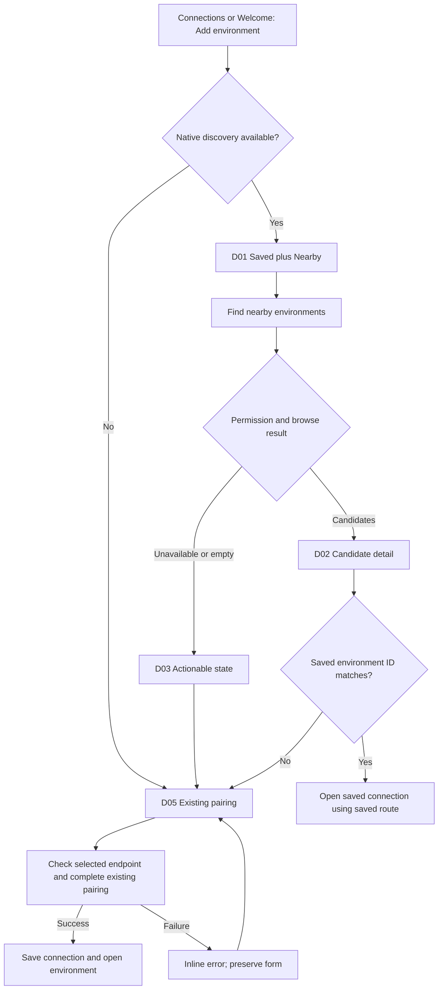
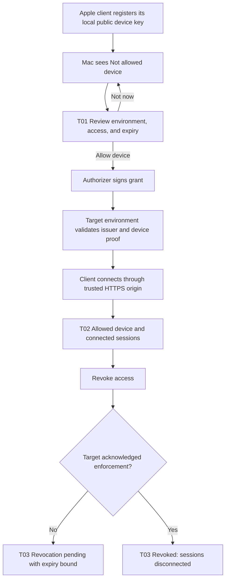

# Environment discovery and trusted pairing: UX specification

Status: **proposed, 2026-10-05**. This is the requested design specification for
[environment-discovery.md](./environment-discovery.md), not shipped behavior.
Discovery is independently shippable; trust screens are a separately gated extension.
[posture.md](./posture.md), [mobile.md](./mobile.md), and the optional appearance
profile in [design-system.md](./design-system.md) govern scope and presentation.

## Design review and revisions

The principal UX risk is allowing a convenient discovery list to imply trust. A
nearby name, matching environment ID, and live service are observations, not approval.
Show connection availability, saved connection status, and device authorization
as separate facts. Never use a single green shield for all three.

Keep the current Host/Pairing code, pairing-link, and mobile QR workflows. Nearby
removes address entry, not pairing. Selecting a candidate does not connect, request
credentials, rewrite a saved route, or grant access. A trusted pairing release later
removes repeated host interaction after a specific device key is approved once.

The proposed persistent avatar cluster should be secondary and deferred. Connections
is the primary home for access management, including revocation and recovery. An
optional static connected-device count can open the same view; device faces and
names must not imply verified human identity. Do not make account sign-in a condition
of discovering or manually pairing an environment.

## Screens and entry points

Screen IDs are stable references shared with the visual specification and assets.

| ID  | Screen                        | Required information and primary action                                                                  |
| --- | ----------------------------- | -------------------------------------------------------------------------------------------------------- |
| D01 | Connections overview          | Saved connections first; Nearby candidates separately; Add environment remains available                 |
| D02 | Nearby candidate detail       | Claimed name, observed endpoint, discovery status, pairing requirement; Set up connection                |
| D03 | Nearby availability           | Permission, searching, empty, paused, or error; relevant retry/settings/manual alternative               |
| D04 | Server advertising            | Explicit opt-in, effective state, network exposure prerequisite; Advertise on local network              |
| D05 | Existing pairing handoff      | Host or trusted pairing link plus code; existing scan action on mobile; Pair                             |
| T01 | Approve a device              | Specific device key, environment, access, expiry; Allow device or Not now                                |
| T02 | Device access detail          | Allowed access, validity, connected sessions, last confirmed state; Revoke access                        |
| T03 | Revocation result             | Per-environment pending, enforced, or failed result; Retry where appropriate                             |
| T04 | Trust and recovery            | Account unavailable/change, server identity mismatch, lost key, expired access; specific recovery action |
| T05 | Non-Mac authorizer enrollment | Server identity, authorizer key, scope ceiling, authenticated provisioning; Enroll authorizer            |

Desktop Settings → Connections and the Welcome wizard use the same D01–D05
discovery presenter. A command-palette action **Add environment** opens that presenter
and focuses its normal first action; reuse a registered shortcut if one already exists.
No dedicated discovery keybinding is needed. Connection selectors open saved
connections; an Add environment action there routes to the same presenter. Nearby never changes
saved routes; authenticated route learning in the normal connection system remains
available and is outside this candidate-only restriction.

Mobile Connections → Add Environment retains its existing form-sheet/full-screen
navigation and QR action. D01 places Nearby within the existing Connections route;
D02–D05 use its normal navigation stack. iPad may use a detail pane when the current
navigation supports it; do not require a new navigation system. Cold-start onboarding
uses the same states and operations, with success returning to the normal Home route.

Hosted and locally served web browsers omit Nearby when no native browser capability
is supplied. They retain manual pairing and normal access-management capabilities.
Do not show a broken Nearby tab, permission request, or browser-extension instruction.
Desktop advertising belongs with existing Network access settings, not Appearance.

## Discovery journey and low-fidelity flow asset

Browsing begins when the user opens Nearby or explicitly selects **Find nearby
environments**. Explain the OS permission before triggering it. Stop browse work
when the screen closes or the app backgrounds; resuming refreshes the snapshot.
Show initial status text without a continuously animated spinner. Candidate updates
do not reorder the focused row, steal focus, or interrupt code entry.

A candidate row shows a bounded name and endpoint, with a text state such as
**Nearby** or **Already saved**. Device model is optional secondary metadata, not an
avatar assertion. Service labels are untrusted text: no markup, clickable supplied
URLs, Unicode control characters, or unbounded wrapping. Names may collide; expose
endpoint and short environment ID in detail so entries remain distinguishable.

For an already saved ID, show **Open saved connection** and use its saved origin.
If that route fails, preserve it and explain **Saved connection unavailable**; a new
advertised address must not silently replace it. If a candidate disappears while its
detail is open, keep the detail with **No longer nearby**, disable candidate-based
handoff, and retain manual pairing. Service loss does not delete a saved connection.

On D05, prefill only candidate information the approved onboarding contract allows.
Make the destination visible before submission. The discovery release retains
existing manual LAN pairing and its transport limitations; an ID match adds no
cryptographic authentication. A discovered origin never receives an existing saved
credential or automatic grant. In the later trust release, a route that cannot meet
the authenticated HTTPS policy shows **Use the trusted connection** or recovery
help; no **Continue anyway** bypass or automatic LAN downgrade is offered.

## Discovery state, action, and copy matrix

| State                              | Suggested copy                                                                          | Available action and behavior                                                                          |
| ---------------------------------- | --------------------------------------------------------------------------------------- | ------------------------------------------------------------------------------------------------------ |
| Not started                        | Find T3 environments on your local network. Pairing is still required.                  | Find nearby environments; Add manually                                                                 |
| Permission explanation             | Allow local network access to find nearby environments.                                 | Find nearby environments triggers platform permission; Add manually                                    |
| Permission denied, reliably known  | Local network access is off for T3 Code.                                                | Open Settings when supported; Add manually; do not repeatedly prompt                                   |
| OS gives no reliable denial signal | No nearby environments found. Check local network permission and network access.        | Permission help; Try again; Add manually; do not claim denial as fact                                  |
| Initial browse                     | Looking for nearby environments…                                                        | Add manually; Cancel/Back; status announced once                                                       |
| Empty                              | No nearby environments found. The environment must advertise on the same local network. | Try again; Add manually; concise setup help                                                            |
| Permission/network unavailable     | Nearby discovery is unavailable on this network.                                        | Try again; Add manually; actionable reason if known                                                    |
| Browse paused                      | Nearby discovery is paused while this app is inactive.                                  | Refresh on return; existing saved connections usable                                                   |
| Candidate                          | Found on your local network. Pairing is still required.                                 | Set up connection; no automatic access                                                                 |
| Candidate matches saved ID         | This environment is already saved.                                                      | Open saved connection; uses saved route                                                                |
| Candidate disappeared              | This environment is no longer nearby.                                                   | Add manually; Back; no destructive cleanup                                                             |
| Descriptor ID mismatch             | This address reports a different environment.                                           | Back; enter trusted pairing link; no credential submission                                             |
| Protocol mismatch                  | Update this client or the environment to connect.                                       | Show which side is incompatible; Back; no bypass                                                       |
| Pairing in progress                | Pairing…                                                                                | Prevent duplicate submit; preserve destination; Back cancellation follows existing operation semantics |
| Pairing failed                     | Pairing failed. [Specific recoverable reason.]                                          | Retry; edit host/code; scan again; preserve non-secret form state only for screen lifetime             |
| Pairing succeeded                  | Environment added.                                                                      | Open environment; return to Connections where appropriate                                              |

D04 uses **Advertise on local network** with explanatory text **Other devices on
this network can see this environment’s name. Pairing is still required.** It defaults
off independently of Network access. Effective states are **Off**, **Advertising**,
**Waiting for network access**, or **Could not advertise**. Saving the preference is
not evidence of successful advertising. Show **Restart required** only if the runtime
actually needs it. Turning off stops future advertisements; it neither removes saved
connections nor revokes authorized devices. State this beside the control when useful.

## Trusted enrollment journey and low-fidelity flow asset

Trust capability is hidden until its provisioning gate passes. No placeholder Apple
sign-in call to action appears in the discovery release. CloudKit account availability
is not equivalent to device approval; a registered entry says **Not allowed**. Family
Sharing must not be presented as authorization. Display **Apple account available**
only as directory context, never as a shield proving server or device identity.

T01 is a deliberate, once-per-device-key approval. Name the environment explicitly,
show the device’s claimed name and model as descriptive text, and expose a short key
identifier with a full-value detail disclosure. Never show private keys or tokens.
The default access preset must map to existing server scopes and summarize practical
power: for a preset permitting agent execution, say **Can run agents and change files
in this environment**. Expiry is visible, with the exact lifetime chosen by the trust
proposal. **Not now** leaves the device unapproved; it does not create a denial policy.
Authentication requiring user presence follows platform conventions after selection.

After signing, distinguish **Grant issued** from **Environment accepted**. Do not
report **Connected** until the normal authenticated connection succeeds. Enrollment
can fail without invalidating an existing manual connection. A blocked or offline Mac
does not prevent already approved unexpired grants from connecting to their target.

T02 separates **Connected now**, **Allowed devices**, and **Registered devices**.
Within a device detail, list sessions and validity rather than pretending one device
equals one socket. Scope is the selected environment; a cross-environment view groups
results by environment and does not imply global enforcement. Revocation is reachable
in Connections without the optional avatar cluster, and the access list is readable
from any supported authenticated client with administrative authority.

## Trust state, action, and copy matrix

| State                            | Suggested copy                                                                      | Available action and behavior                                                                   |
| -------------------------------- | ----------------------------------------------------------------------------------- | ----------------------------------------------------------------------------------------------- |
| Registry entry only              | Not allowed                                                                         | Review device on authorizer; no connect through registry alone                                  |
| Approval awaits authorizer       | This device needs approval on your Mac.                                             | Existing pairing; Retry when Mac available; no promise of background approval                   |
| Grant issued, acceptance unknown | Access issued; environment confirmation pending.                                    | Retry connection; show grant validity                                                           |
| Approved, disconnected           | Allowed until [date/time]                                                           | Connect through stored trusted route; Revoke access                                             |
| Active session                   | Connected now                                                                       | Show environment and session list; Revoke access                                                |
| Grant expired                    | Device access expired.                                                              | Request renewed approval; existing pairing; no automatic broad renewal                          |
| Grant revoked locally            | Access revoked. Active connections were disconnected.                               | Close; renew only through explicit approval                                                     |
| Remote target offline            | Revocation pending for [environment]. Access may continue until [expiry].           | Retry; show last confirmed timestamp; per-target result                                         |
| Remote enforcement failed        | Could not confirm revocation on [environment].                                      | Retry; show specific reason without sensitive diagnostics                                       |
| Account unavailable              | Apple account unavailable. Existing approved access remains valid until its expiry. | Retry account check; existing pairing; no permission conflation                                 |
| Account changed                  | Apple account changed. Review this account before enrolling devices.                | Review account context; clear old account-scoped directory views; no automatic root replacement |
| Device key missing               | This installation no longer has its approved device key.                            | Enroll as a new device; existing pairing; existing old-key grants remain visible for revocation |
| Environment identity changed     | This environment’s trusted identity changed.                                        | Recover through existing trusted host/SSH path; no Continue anyway                              |
| Secure endpoint unavailable      | The trusted connection is unavailable.                                              | Check Tailscale; Retry; no automatic LAN fallback                                               |
| Authorizer lost                  | The authorizer is unavailable. New device approval needs recovery.                  | Explain local/SSH recovery; existing valid access remains bounded by expiry                     |

Revoke confirmation names device and environment: **Revoke [device]’s access to
[environment]?** Body: **This prevents new connections and disconnects its active
sessions when this environment confirms revocation. Work already started may continue.**
Action: **Revoke access**. A receipt drives success; submitting a command does not.
For the current administering device, follow server self-revocation rules and explain
the recovery requirement rather than creating a UI-only exception. Pending state
survives navigation/relaunch through durable server or broker state.

## Non-Mac broker and recovery

T05 is part of the existing authenticated SSH/local provisioning workflow. Show the
target environment, the Mac authorizer key identifier, and the permitted scope
ceiling before enrollment. The authorizer is an approval service, not a traffic route;
the target remains the connection destination. Never infer enrollment from discovery
or from a new CloudKit record. A simple **Authorizer: [Mac]** detail links to recovery.

A Linux or Windows target with a valid grant can work while the Mac sleeps. New
approval or renewal may need the Mac. Remote revocation remains pending until the
target acknowledges enforcement, with a visible maximum expiry bound. Recovery
uses authenticated local/SSH access to replace the root and retire old authority;
the UI explains affected devices and separately tracks unreachable environments.
No account-sync overwrite, generic reset, or deletion of thread history is offered.

## Accessibility, visual behavior, and performance

Use existing web UI variants and native controls; parent layouts own spacing. Upstream
appearance remains default, and the same hierarchy works with the opt-in Ledger
profile. Do not invent a trust-specific palette. Status has text and a semantic icon,
not color alone. Pending revocation is an ordinary pending state, not green success.

Provide visible labels for Host, Pairing code, access, and expiry. Row actions include
their device/environment in accessible names. Desktop dialogs trap focus and restore
it to their opener; inline errors are associated with their field, and keyboard users
can inspect endpoints without hover. Native forms support VoiceOver/TalkBack, dynamic
type, safe areas, reduced motion, and platform-sized touch targets. Long labels wrap
without pushing the primary action offscreen. Standard scrolling provides all content.

Announce initial browse status, completed pairing, and revocation results once. Batch
candidate updates rather than speaking every service event; preserve keyboard focus
and stable row keys. Subscribe only while the discovery surface is active, and use
event-driven updates for sessions and grants. No continuous animations or periodic
client polling. Never include pairing secrets in screenshots, announcements, logs,
public review fixtures, or copied status diagnostics.

## Acceptance criteria by release

- **Discovery:** desktop Welcome and Connections, mobile onboarding and Connections,
  and all Add environment entry points reach the same behavior. Browser-only surfaces
  retain pairing. Denied/unknown permission, empty list, duplicate names, candidate
  disappearance, ID mismatch, incompatible protocol, app backgrounding, and failed
  pairing each have the stated recovery action. Saved routes never change implicitly.
- **Advertising:** disabled by default; exposure prerequisite and effective state are
  visible; off stops publication without revoking clients. Unavailable platforms do
  not show a toggle that falsely claims success.
- **Trust:** unapproved registry keys cannot connect. Approval shows actual scope and
  expiry. Account change, local key loss, identity change, and unavailable secure
  origin cannot silently downgrade or replace authority. Existing pairing survives.
- **Revocation:** device revoke cascades to descendant sessions and tickets. Local
  success follows an enforcement receipt; offline targets show pending and expiry.
  Restart/relaunch cannot turn a pending result into success or revive a revoked grant.
- **Broker:** authenticated root enrollment and recovery work for one Mac authorizer;
  already approved target access survives Mac sleep until expiry; renewal and pending
  revocation remain explicit. Multi-authorizer machinery is not required.
- **Integrated verification:** one real-client pass per affected web/desktop/mobile
  implementation, including keyboard or screen-reader checks, long labels, enlarged
  text, and both supported appearance profiles. This design task has not run clients;
  mockups are proposed assets, not evidence of implemented behavior.
